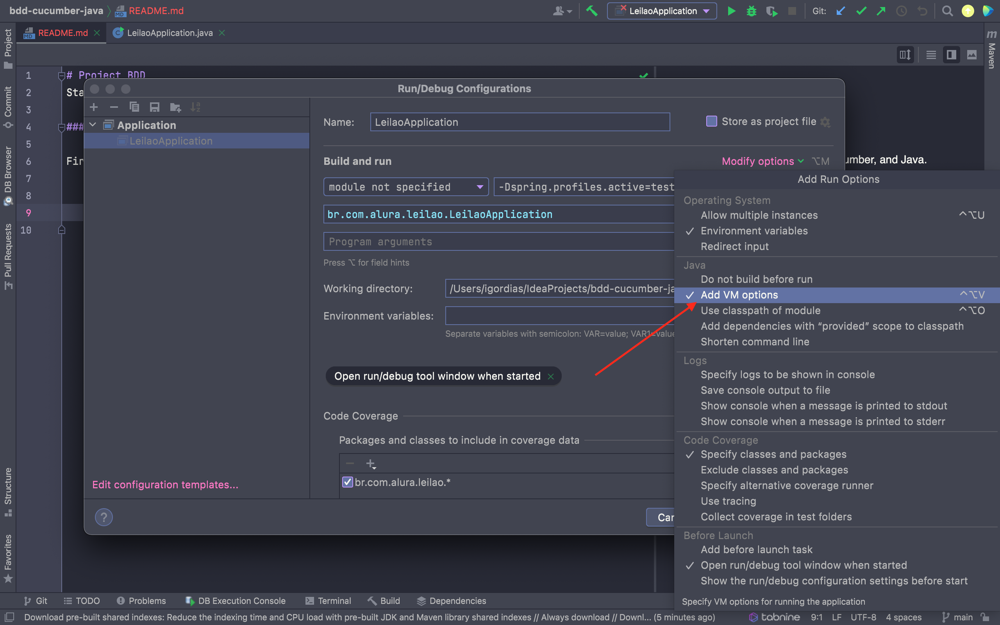

# Project BDD
Project using BDD, Cucumber, and Java.

- Writing features with cucumber;
- DataTables;
- Selenium Integration;
- Tags and Context;

### Run the project in IntelliJ

First, we need to add this code  on our VM Options

Go in Edit configurations

Click in Modify options

Click in Add VM Options

Insert the code `-Dspring.profiles.active=test`

After this, navigate to /src/main/java/br.com.alura/leilao 
in the class LeilaoApplication on the line 12 click in the green button and Run.

Access the `https://localhost:8080` to see the project running.